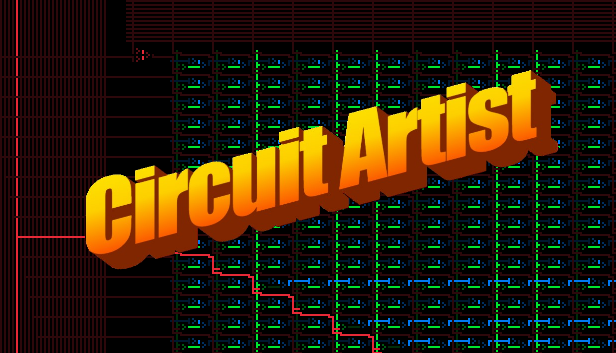
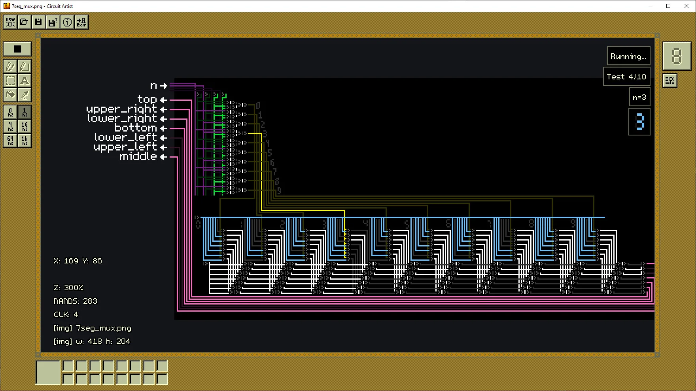
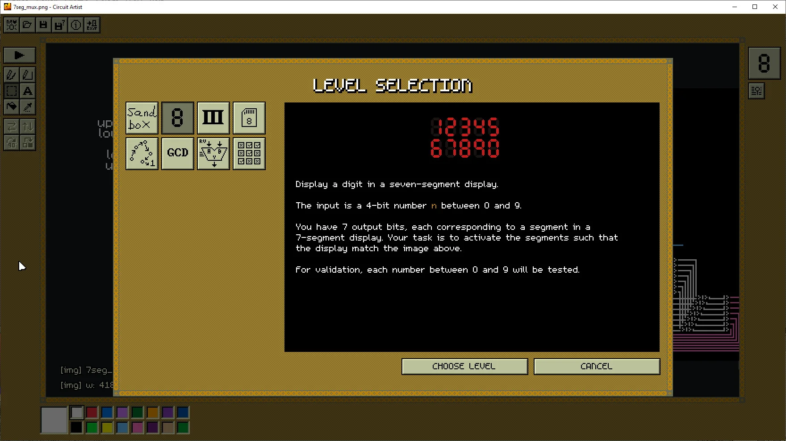
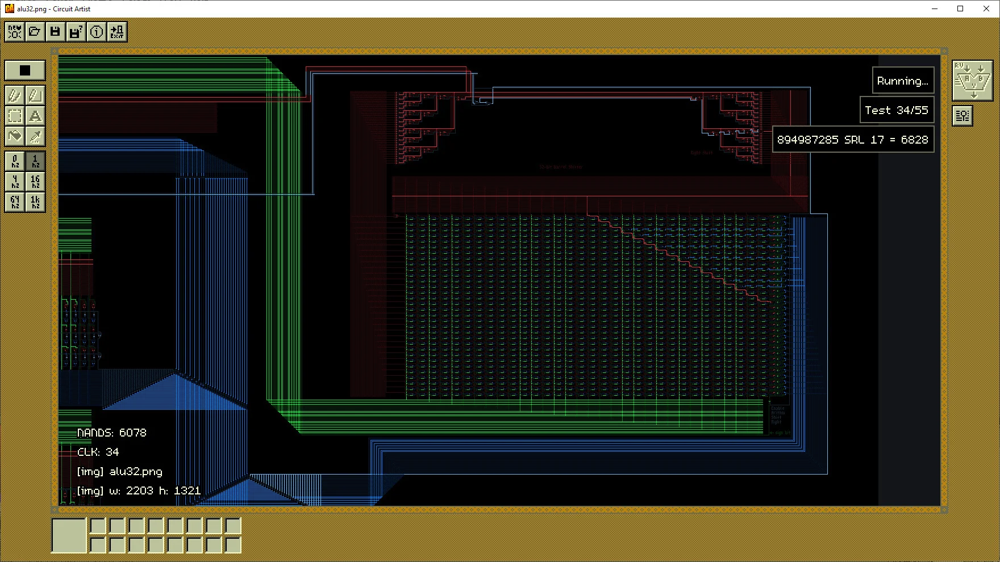
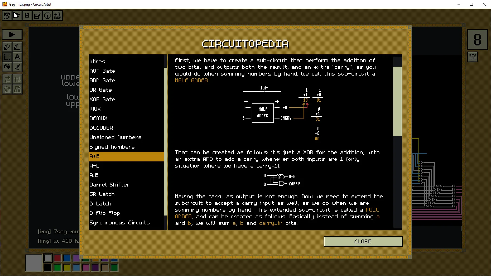

Circuit Artist is a digital circuit drawing and simulation game. Circuits are images. You can play in sandbox mode or solve puzzles. You can use lua to interact with your circuit.

- [steam](https://store.steampowered.com/app/3139580/Circuit_Artist/)
- [discord](https://discord.gg/McpSTEW5jU)

Made with [raylib](https://www.raylib.com/).

## Game Rules

- Little pixel triangles are NANDs.
- Black pixels are background.
- Everything else is a wire.

## Screenshots

## Building

Compiles in Windows, Linux and Mac.

- Need to build within the `build/` directory (or something within the root directory so it can access `luasrc/` and `asset/` folder)
- You need to compile `LuaJIT/`. You can see the instructions [here](https://luajit.org/install.html). The binaries will go to the `LuaJIT/src` folder. In MAC it seems you need to install it too. In linux I've managed to make it work with a symbolic link from `build/`. In Windows it worked directly with the cmake directives ( if it doesnt for you mind that it might be something related to link path).
- In linux it might complain that it can't find `libraylib.so`, that's because linux won't look for libraries in the directory it is in, you can fix with it `LD_LIBRARY_PATH=$PWD ./ca` until we find a cleaner solution.
- By default OPENMP is off, you might want to activate in the `OPENMP` cmake option.

The Linux and MAC versions are not stable yet: they compile but have some divergences from windows version.

## License

GPLv3. See LICENSE file. For dependencies, see `third_party` folder.
